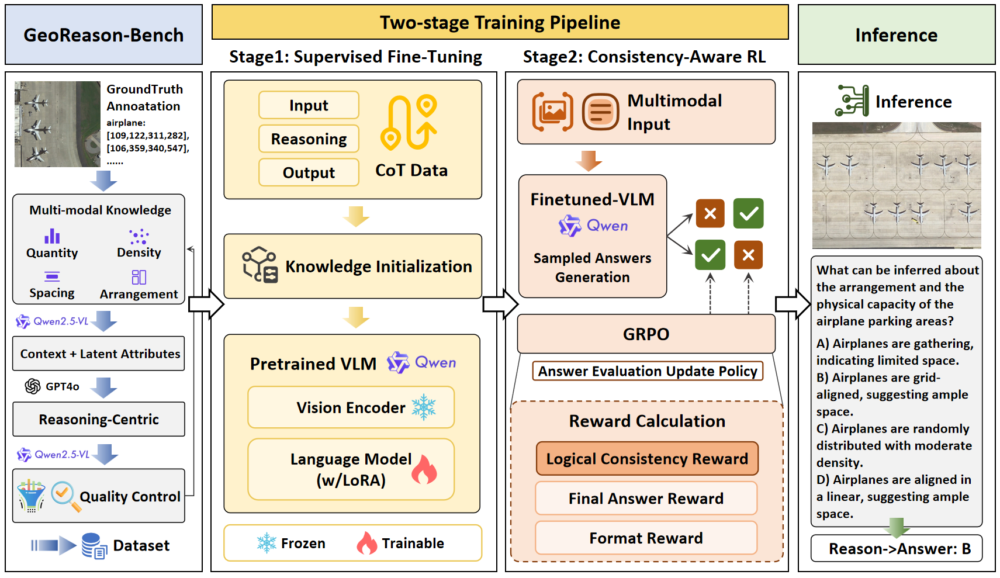
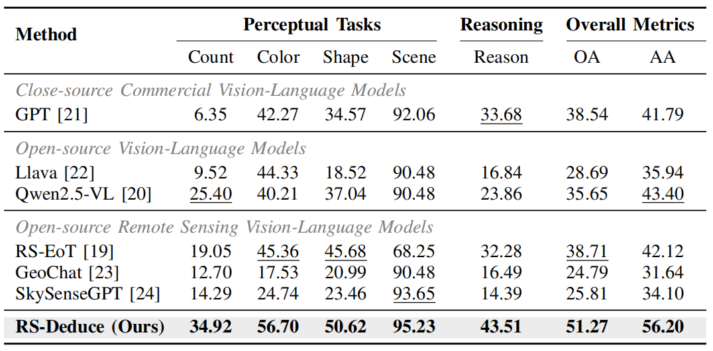

<p align="center">
  <h1 align="center">GEOREASON: ALIGNING THINKING AND ANSWERING IN REMOTE SENSING VISION-LANGUAGE MODELS VIA LOGICAL CONSISTENCY REINFORCEMENT LEARNING</h1>
  <p align="center">
      Wenshuai Li</a><sup></sup>&emsp;
      Xiantai Xiang</a><sup></sup>&emsp;
      Zixiao Wen</a><sup></sup>&emsp;
      Guangyao Zhou</a><sup></sup>&emsp;
      Ben Niu</a><sup></sup>&emsp;
      Feng Wang</a><sup></sup>&emsp;
      Lijia Huang</a><sup></sup>&emsp;
      Qiantong Wang</a><sup></sup>&emsp;
      Yuxin Hu</a><sup></sup>&emsp;
      <div align="center">
      <a href='http://arxiv.org/abs/2601.04118'></a>
      <a href='https://huggingface.co/WenshuaiLi/GeoReason'></a>
      <a href='https://huggingface.co/datasets/WenshuaiLi/GeoReason-Bench'></a>
      </div>
    <p align='center'>
        If you find our work helpful, please consider giving us a ⭐!
    </p>
   </p>
</p>

---

## GeoReason: Overview
GeoReason is a framework designed for Remote Sensing Vision-Language Models (RS-VLMs) to address "logical hallucinations" and "pseudo-reasoning," where models derive correct answers from flawed logic or shortcuts. By introducing a logic-driven dataset (GeoReason-Bench) and employing a consistency-aware reinforcement learning strategy with a novel "Logical Consistency Reward," it compels the model to strictly anchor its final decisions in verifiable reasoning traces, ensuring both accuracy and cognitive reliability.
<p align="center"></p>

---

## Performance
Eevaluating models across Perceptual Tasks (Count, Color, Shape, Scene) and Reasoning Tasks (Reason) to analyze their multi-level understanding.
<p align="center"></p>

---

## Get Started

### Environment Installation

```bash
conda create -n GeoReason python=3.10
conda activate GeoReason
pip install -r requirements.txt
```

### Infer with GeoReason
You can use `GeoReason_infer.py` to generate the answers to the questions.
```bash
python GeoReason_infer.py --model_path /path/to/model --dataset /path/to/dataset --image_path /path/to/image_path
```

## Citation
@misc{li2026georeasonaligningthinkinganswering,
      title={GeoReason: Aligning Thinking And Answering In Remote Sensing Vision-Language Models Via Logical Consistency Reinforcement Learning}, 
      author={Wenshuai Li and Xiantai Xiang and Zixiao Wen and Guangyao Zhou and Ben Niu and Feng Wang and Lijia Huang and Qiantong Wang and Yuxin Hu},
      year={2026},
      eprint={2601.04118},
      archivePrefix={arXiv},
      primaryClass={cs.CV},
      url={https://arxiv.org/abs/2601.04118}, 
}
